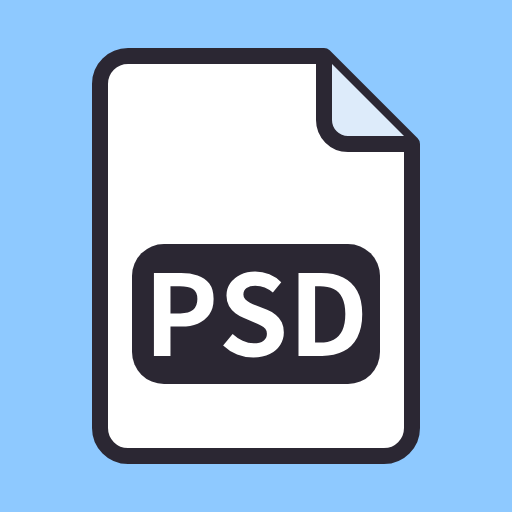

# Beutl.Extensions.PsdTachie



PSDファイルを立ち絵として表示するBeutlの拡張機能です。レイヤーの表示を切り替えられ、音声に合わせた口パクと自動の目パチができます。

## 使い方

1. ライブラリの「PSD立ち絵」をタイムラインに追加します。
2. プロパティの「PSDファイル」で `.psd` / `.psb` を選びます。
3. 「レイヤー」のツリーで表示するレイヤーを選びます。
4. 口パクと目パチを使う場合は、ツリーで口と目のレイヤーにポインターを合わせ、行の右側に出る「割り当て」から「開いた口」などを選びます。

「レイヤー」のチェックは、時間がたっても変わらない見た目（服装・眉・ポーズなど）を決めます。口パクと目パチに割り当てたレイヤーは、行の右側に割り当て先が表示されたままになり、チェックに関係なく表示が自動で切り替わります。1つのレイヤーに割り当てられる形は1つで、別のレイヤーに同じ形を割り当てると、前のレイヤーからは外れます。「（なし）」を選ぶと割り当てを外せます。

### レイヤー名の規約

PSDToolKitなどで使われている命名規約に従います。

| 先頭の記号 | 意味 |
| --- | --- |
| `*` | 同じグループ内の `*` 付きレイヤーのうち、1つだけを表示します（ラジオボタン）。 |
| `!` | 常に表示します。非表示にはできません。 |

### 口パク

- 「口パクの音声」に音声ファイルを指定すると、その音量に合わせて口のレイヤーを切り替えます。
- 「閉じた口」「半開きの口」「開いた口」の3つのうち、割り当てたものだけを使います。半開きを省略すると、閉じた口と開いた口の2段階になります。
- 「半開きにする音量」「開く音量」（dBFS）で切り替わる音量を調整します。
- 音声がオブジェクトの途中から始まる場合は「音声の開始位置」でずらします。
- 要素の右クリックメニューの「オリジナルの長さに変更」で、要素の長さを音声の終わり（開始位置を含む）に合わせられます。音声を指定していない場合は使えません。

### 目パチ

- 「開いた目」「半目」「閉じた目」を割り当てると、一定間隔でまばたきします。
- まばたきの時刻は乱数シードから決まるので、プレビューと書き出しで同じ結果になります。

## 対応しているPSD

- RGBとグレースケール、8・16・32ビット、PSDとPSB（32ビットの値はPhotoshopと同じく線形光として扱います）
- 圧縮形式はRAW、RLE、ZIP（予測あり・なし）
- グループ、不透明度、塗りの不透明度、主な描画モード、クリッピングマスク、レイヤーマスク
- Unicodeのレイヤー名と、日本語版Photoshopが書くShift_JISのレイヤー名

## 既知の制約

- ファイルはBeutl標準のファイル選択エディタで選びます。ファイルの参照は絶対パスで保存されるため、プロジェクトごとフォルダを移動すると参照し直しが必要です。書き出し前の欠落ファイル検出の対象にもなりません。本体側の改善（b-editor/beutl#2704）を待って、`IFileSource` を使う形に戻す予定です。
- 「レイヤー」の状態はアニメーションできません。途中で表情を変えるときは、オブジェクトを分割してください。分割すると後半の「音声の開始位置」が自動で調整されるので、口パクは音声に合ったままです。まばたきは後半の先頭からやり直します。
- レイヤー効果（ドロップシャドウなど）、調整レイヤー、ベクトルマスク、CMYK・Labのドキュメントは描画しません。
- 口パクは音量だけで判定します。母音に合わせた口形には対応していません。

## 開発

`Beutl.Extensibility.Sdk` 2.0.0-preview.8 でビルドします。

```bash
dotnet build src/Beutl.Extensions.PsdTachie
```

```bash
dotnet test tests/Beutl.Extensions.PsdTachie.Tests
```

テストは次の3種類です。

- **パーサーと合成**: psd-tools（独立したPSD実装）で作ったPSDと、その合成画像を正解として比較します。フィクスチャは `tools/make_psd_fixtures.py` で再生成できます。
- **描画**: Beutlの `SceneRenderer` を使い、エディタを起動せずにシーンを描画して画素を確認します。描画した画像は `bin/Debug/net10.0/rendered/` に保存されます。グラフィックスコンテキストを作れない環境では、このテストはスキップされます。
- **プロパティエディタ**: Avalonia.Headlessでエディタを操作し、プロパティへの書き込みを確認します。

Beutlにサイドロードして試す場合は、次のコマンドで `~/.beutl/sideloads` に出力します。

```bash
dotnet build src/Beutl.Extensions.PsdTachie -p:DebugApplication=true
```

## ライセンス

[MIT License](LICENSE)
